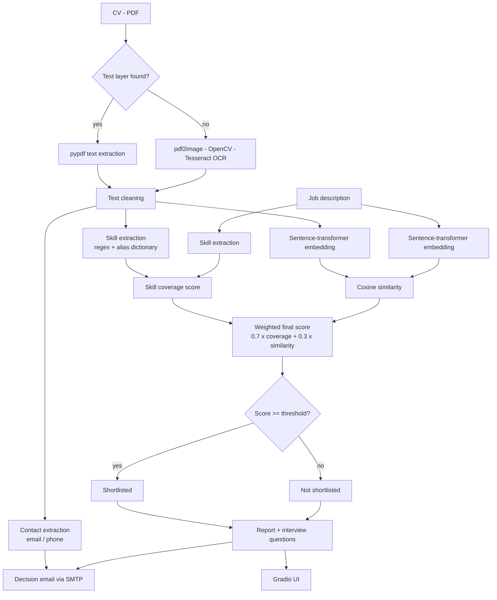

[README.md](https://github.com/user-attachments/files/32277183/README.md)
# AI-Powered CV Matching System

An intelligent screening assistant that reads a candidate's CV, extracts the
skills inside it, compares them against a job description, and produces an
explainable match score with a hiring recommendation, learning advice, and
suggested interview questions.

Built as a graduation project.

---

## The problem

A single technical vacancy attracts hundreds of CVs. Recruiters spend only a
few seconds on each one, so strong candidates are missed and weak ones move
forward. Applicants, on the other hand, are rejected without ever learning
which skill was missing.

## The solution

| For recruiters | For candidates |
|---|---|
| Screens a CV in seconds instead of minutes | Instant feedback instead of silence |
| Consistent, rule-based scoring for every applicant | A concrete list of missing skills |
| Ready-made interview questions per candidate | Suggested learning resources |
| Automatic decision email | Understandable reason for the outcome |

---

## Features

- **PDF parsing with OCR fallback** - digital CVs are read with `pypdf`; if a
  CV turns out to be a scan, the system automatically renders the pages,
  applies grayscale + Otsu thresholding with OpenCV, and runs Tesseract OCR.
- **Skill extraction** - a categorised skill dictionary with aliases, matched
  as whole words so "international" is not detected as `nat` and "HTML" is not
  detected as `ml`.
- **Hybrid scoring** - keyword coverage (explainable) combined with
  sentence-transformer cosine similarity (meaning-aware).
- **Contact extraction** - email and phone number pulled from the CV with
  regular expressions.
- **Explainable report** - matched skills, missing skills, extra skills,
  score breakdown, learning resources, interview questions.
- **Automatic decision email** - opt-in, with credentials read from
  environment variables.
- **Gradio web interface** - upload, analyse, and read the result in a browser.

---

## Architecture



Component map:

| Module | Responsibility |
|---|---|
| `src/config.py` | Settings and secrets, loaded from `.env` |
| `src/cv_parser.py` | PDF text extraction, OCR fallback, contact details |
| `src/skills.py` | Skill dictionary loading and whole-word extraction |
| `src/matcher.py` | Skill coverage, semantic similarity, final score |
| `src/report.py` | Report text, recommendations, interview questions |
| `src/mailer.py` | SMTP decision email |
| `src/pipeline.py` | Orchestrates the full flow |
| `app/app.py` | Gradio user interface |

---

## Project structure

```
.
├── app/
│   └── app.py                   # Gradio interface
├── src/
│   ├── config.py
│   ├── cv_parser.py
│   ├── skills.py
│   ├── matcher.py
│   ├── report.py
│   ├── mailer.py
│   └── pipeline.py
├── data/
│   └── skills_database.json     # Categorised skills with aliases
├── notebooks/
│   └── AI-Powered_CV_Matching_System.ipynb
├── docs/
│   ├── architecture.md
│   └── demo_video_script.md
├── requirements.txt
├── .env.example
└── README.md
```

---

## Setup

### 1. System packages (only needed for the OCR fallback)

```bash
# Ubuntu / Debian
sudo apt-get install -y poppler-utils tesseract-ocr

# macOS
brew install poppler tesseract
```

### 2. Python environment

```bash
git clone https://github.com/<your-username>/ai-cv-matching-system.git
cd ai-cv-matching-system

python -m venv .venv
source .venv/bin/activate          # Windows: .venv\Scripts\activate

pip install -r requirements.txt
```

### 3. Configuration

```bash
cp .env.example .env
```

Then open `.env` and fill in the SMTP values if you want the decision email.
For Gmail you need a 16-character **App Password**
(Google Account → Security → 2-Step Verification → App passwords), not your
normal account password. `.env` is listed in `.gitignore` and must never be
committed.

### 4. Run

```bash
python app/app.py
```

The interface opens at `http://127.0.0.1:7860`.

---

## How the score is calculated

```
skill_coverage  = matched required skills / all required skills  x 100
semantic_score  = cosine( embedding(CV), embedding(job) )         x 100
final_score     = 0.7 x skill_coverage + 0.3 x semantic_score
```

A candidate is shortlisted when `final_score >= 70`. All three weights and the
threshold are configurable in `.env`.

---

## Challenges faced

1. **Scanned CVs returned empty text.** `pypdf` only reads an embedded text
   layer, and roughly one CV in five is an exported image. Solved with an
   automatic OCR fallback triggered when fewer than 50 characters are
   extracted, using grayscale conversion and Otsu thresholding before
   Tesseract to raise accuracy on low-contrast scans.

2. **Substring matching produced false skills.** Checking `if "nat" in text`
   marked every CV containing "international" as knowing NAT, and "HTML"
   registered as "ml". Every skill is now compiled into a whole-word regular
   expression with escaped punctuation for names such as `c++` and `tcp/ip`,
   plus an alias list so "routers" maps to `routing`.

3. **Keyword matching alone was too rigid.** A strong CV worded differently
   from the vacancy scored badly. Adding sentence-transformer embeddings gave
   a meaning-aware signal, but on its own it is a single unexplainable number,
   so the two are combined in a weighted score that stays auditable.

---

## Future work

- Fine-tune a domain-specific embedding model on real CV / vacancy pairs.
- Rank a batch of CVs against one vacancy and export a shortlist to CSV.
- Add an LLM layer to summarise experience and detect seniority, not just skills.
- Arabic CV support (Arabic OCR model and a bilingual embedding model).
- Bias auditing: strip names, gender and nationality before scoring.
- Deploy as a hosted service with a database of candidates and vacancies.

---

## Team

| Name | Role |
|---|---|
| _Add name_ | _Add role_ |
| _Add name_ | _Add role_ |

## Links

- Demo video: _add link_
- Presentation slides: _add link_

## License

MIT
